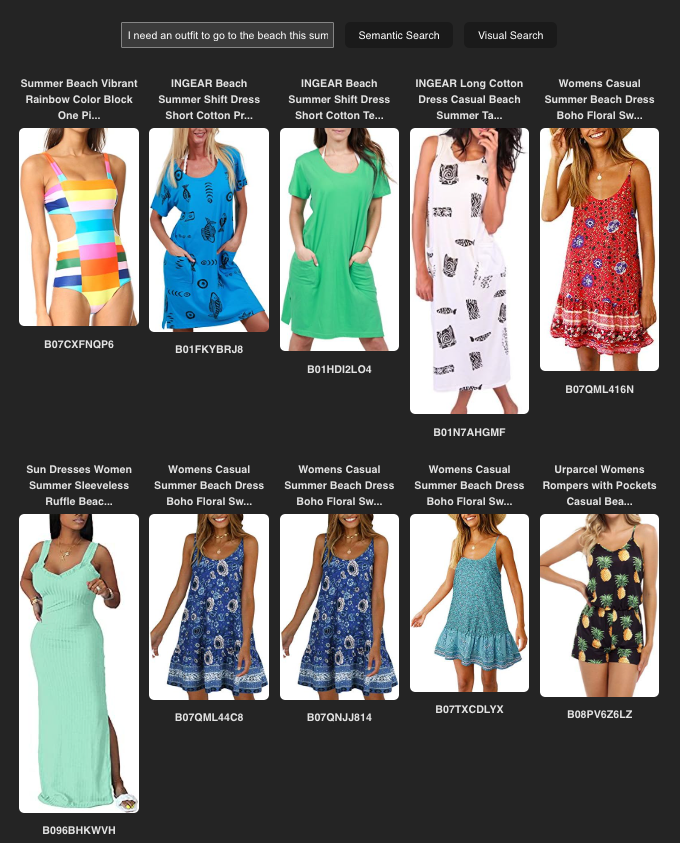
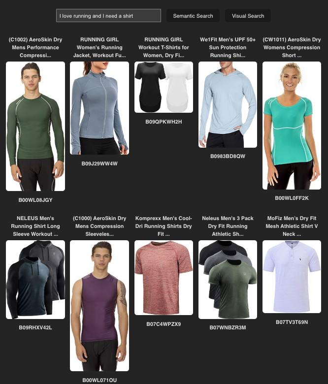
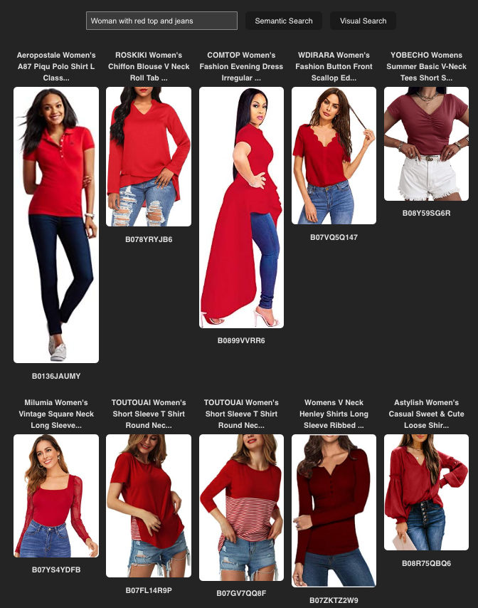
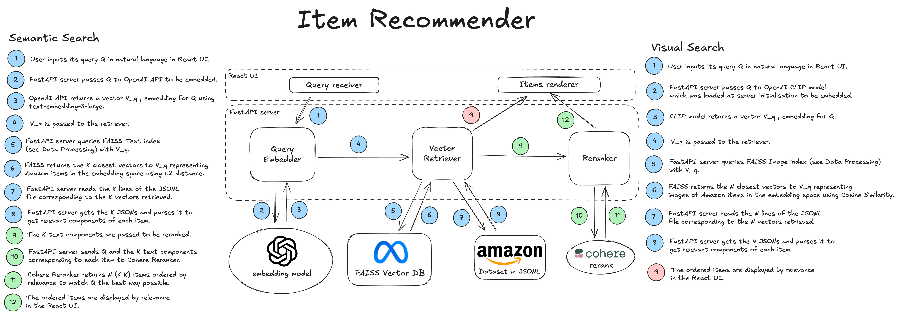
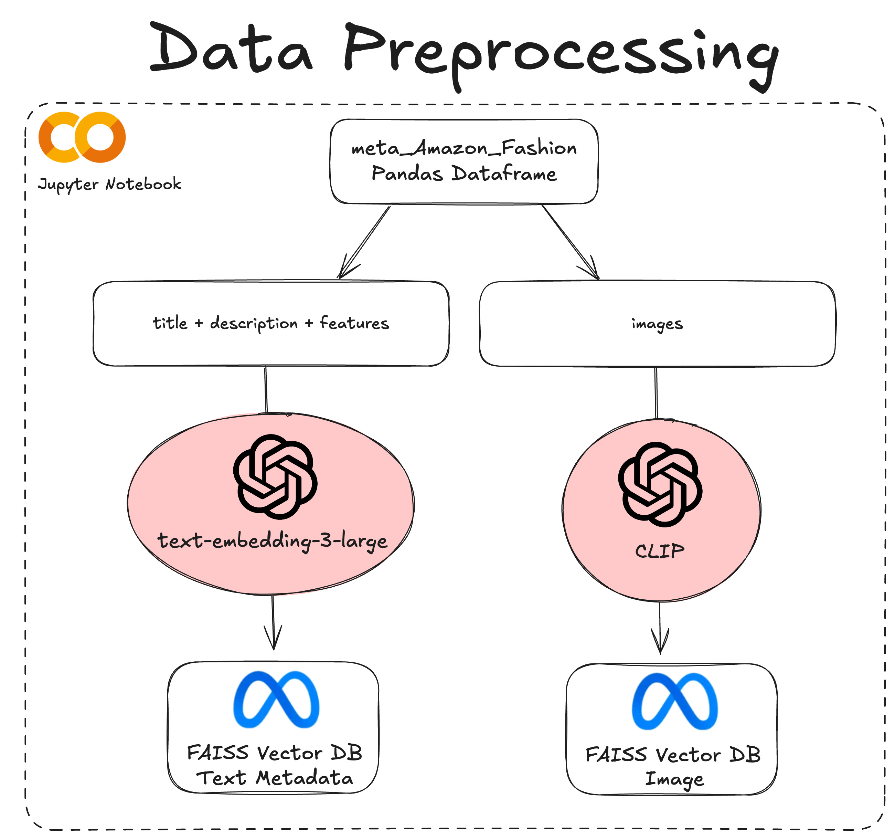

# Items Recommender

This repo contains a prototype application to query fashions items using natural language. It provides a simple React UI to interact with a FastAPI server performing the search. The 100,000 fashion items used in this repo are extracted from 800,000+ elements included in [Amazon Fashion open-source dataset](https://huggingface.co/datasets/McAuley-Lab/Amazon-Reviews-2023).

The prototype presents 2 different ways for a user to get recommendations using natural language:

- **Semantic Search** parses the user query and retrieves relevant items thanks to their metadata by leveraging OpenAI text-embedding-3-large and Cohere Reranker. A sample of 100,000 items is used in this prototype.
- **Visual Search** parses the user query and retrieves matching item images thanks to OpenAI [CLIP](https://openai.com/index/clip/) model. A sample of 50,000 items is used in this prototype.

## Project setup

This repository is set up to be run locally using Docker. Please ensure you have Docker installed on your computer or follow these [instructions](https://docs.docker.com/get-started/get-docker/).

To launch the application, you need to execute the following Bash script in the current directory:

```
bash run_app.sh
```

This Bash script will build and run 2 Docker containers respectively containing the FastAPI backend server and the React UI web server.

Once executed, you can reach the React UI by opening this [link](http://localhost:3000/).

## Sample usage

### Semantic search

Input: "I need an outfit to go to the beach this summer"

Output:



References of the selected Amazon products:

```
['B07CXFNQP6', 'B01FKYBRJ8', 'B01HDI2LO4', 'B01N7AHGMF', 'B07QML416N', 'B096BHKWVH', 'B07QML44C8', 'B07QNJJ814', 'B07TXCDLYX', 'B08PV6Z6LZ']
```

Input: "I love running and I need a shirt"

Output:



References of the selected Amazon products:

```
['B00WL08JGY', 'B09J29WW4W', 'B09QPKWH2H', 'B0983BD8QW', 'B00WL0FF2K', 'B09RHXV42L', 'B00WL071OU', 'B07C4WPZX9', 'B07WNBZR3M', 'B07TV3T69N']
```

### Visual search

Input: "Woman with red top and jeans"

Output:



References of the selected Amazon products:

```
['B0136JAUMY', 'B078YRYJB6', 'B0899VVRR6', 'B07VQ5Q147', 'B08Y59SG6R', 'B07YS4YDFB', 'B07FL14R9P', 'B07GV7QQ8F', 'B07ZKTZ2W9', 'B08R75QBQ6']
```

## Key design decisions

You will find below [Architecture JPEG](docs/architecture/complete_architecture.jpeg). You can also find the [Data Processing JPEG](docs/architecture/complete_data_processing.jpeg) in the _docs_ folder.





### Semantic search: Combining retriever and reranker

In order to obtain enhanced performances, this Semantic Recommender does more than retrieval.

First, the app retrieves 100 elements using a RAG-like L2 distance computation in a prebuilt vector database to apply a first large filter on the database based on the incoming query.

Then, the Reranker performs a forward path in a Transformer using the 100 retrieved elements to order them and output the 10 best ones. This forward path could not be done with our initial database of 100,000 items for obvious performance and cost reasons.

At runtime, this combination enables users to get more relevant results while not waiting for more than 6 seconds.

### Semantic search: Choosing a reranker over GPT4.5

Instead of using a reranker, GPT4.5 could have been used for selecting the most relevant products if combined with some prompt engineering and structured output (see below).

```
Given the user query: "I need an outfit to go to the beach this summer."
Here are 5 possible fashion items from our database:
1. ...
2. ...
3. ...
4. ...
5. ...
Please rank them from most to least relevant.
```

However, [state-of-the-art recommender methods](https://arxiv.org/pdf/2305.02156) indicate that rerankers are the most efficient at this task. On top of that, reranker latency is lower (no sequential token generation) and their cost is easier to control.

It's still important to note that GPT4.5 would have permitted more flexibility by tuning the prompt and match our specific task of fashion recommendation.

### Reading only the relevant lines of the Amazon Dataset

Amazon Dataset is in JSONL format. At runtime, I leveraged that format to extract only the features from the 100 retrieved elements after similarity search. To do so, I used the line number of each item in Amazon JSONL file as their _primary key_ in the FAISS index.

This choice enabled me to reach a fast reading of the originial dataset without having to transform this dataset at all.

### Server start-up loaders

To enhance performance at runtime, the CLIP model and the 2 FAISS indices are loaded at start-up. This slows the server start-up but makes the App more interactive for the final users.

### Using local FAISS indices

After testing searches on other vector DBs including online ones like Pinecone, I opted for a local FAISS index as it was opensource and free for any amount of data ans it enabled me to be extremely flexible in my testing locally by switching from one index to another.
Unfortunately, this method requires a few GBs of local storage !

### API with 2 simple endpoints

Considering the clarity of the workflow, I wanted to keep the API design as simple as possible by implementing 2 simple /search and /image-search endpoints. This also enabled me to ease the networking needs between the 2 Docker containers at runtime by having a ultra simplified interface.

## Data exploration and prototyping

Two fully executed Jupyter Notebooks are provided in ./docs/exploration.

- The [Data Exploration one](docs/exploration/Data_Exploration.ipynb) enabled me to explore data at scale and quantitatively confirm assumptions on the features.
- The [Semantic Search Prototyping one](docs/exploration/Semantic_Search_Prototyping.ipynb) enabled me to create the FAISS index by batching requests to OpenAI API and to test the workflow end-to-end with Cohere API.
- The [Visual Search Prototyping one](docs/exploration/Image_Search_Prototyping.ipynb) enabled me to create the FAISS index by batching requests to CLIP on a T4 GPU offered by Google Colab and to test the workflow end-to-end.

## Potential improvements

### Search parametrisation

For the end-user, selecting a number of items to display would be relevant for some types of searches. This integer could be passed as an integer to the API in order to modify the number of finally outputted results.

### Performance optimisations

To be deployed in production, more testing should be done on the FAISS index at scale. Distribution of the index in multiple smaller indices and parallelisation of distance computations might be relevant to put in place to improve latency.

### Security

In this prototype:

- Cohere API key (free account) and OpenAI API key (provided by Recruiting team) are shared in .env of this repository.
- All files in /backend/data are stored unencrypted at rest.
- Connections between backend and frontend are made over HTTP (not HTTPS).

The above elements would obviously need to be addressed before deploying the prototype anywhere else than locally.
